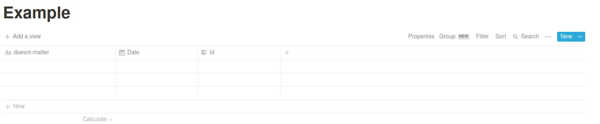

<h1 align="center"><strong> Raco to Notion </h1></strong>

<p align="center">
  
</p>
<br>

_Raco to Notion_ is a script made to be able to sync automatically Raco de la FIB's calendar events with your Notion Database.

## **Installation**

### 1. Setup your local project

To clone and run this script, you'll need [Git](https://git-scm.com) and [Node.js](https://nodejs.org/en/download/) (which comes with [npm](http://npmjs.com)) installed on your computer. From your command line:

```zsh
# Clone this repository locally
git clone https://github.com/learningbizz/RacoToNotion.git

# Switch into this project
cd racoToNotion/

# Install the dependencies
npm install
```

### 2. Set your environment variables in a `.env` file

```zsh
LINK_ICAL=<your-raco-calendar-ical-link>
NOTION_API_KEY=<your-notion-api-key>
NOTION_DATABASE_ID=<notion-database-id>
```

You can find your Raco calendar link [here](img/raco_calendari.png).

You can create your Notion API key [here](https://www.notion.com/my-integrations).

You can find out how to find your Notion database ID [here](https://stackoverflow.com/questions/67728038/where-to-find-database-id-for-my-database-in-notion).

### 3. Setup your Notion Database

For this script to work correctly in your Notion Database, there are 2 properties that **MUST EXIST WITH THE SAME NAME AND FORMAT** ⚠️

-   Date: Property type: Date and Name of the property: `Date`
-   Id: Property type: Text and Name of the property: `Id`

Like this:



## Usage

In the `notionToRaco` directory, open a terminal and run:

```zsh
npm start
```

<br>

# **Reflection**

## **My motivation**

After using Notion for my university studies for a few months, I saw myself painfully adding exam and paper due dates to my main Notion calendar every few days. Therefore, I started investigating to see if this process could be automated using Notion's new API, and that's when the journey began! 🚢

## **What I learned**

-   Javascript asynchronous programming (and how the Javascript event loop works).
-   How to use Notion's API (first time using it).
-   Node.js project development (as it's the first time using node, I learned about npm and how dependencies work).
-   How to use eslint and prettierrc.
-   How and why to use `dotenv`.
